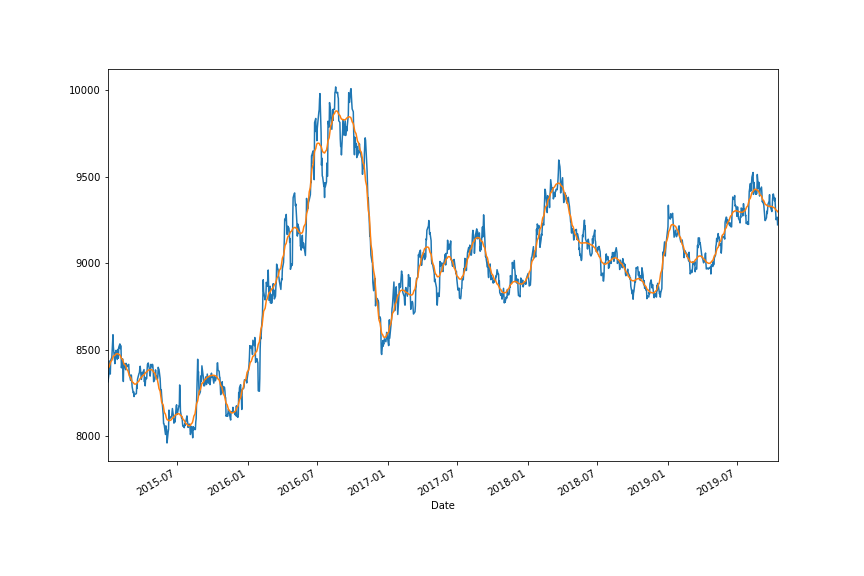
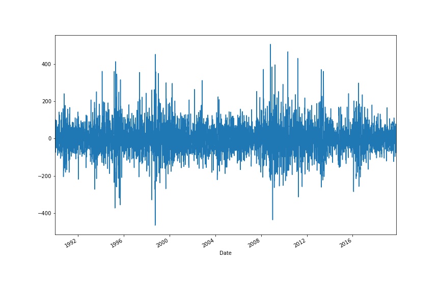
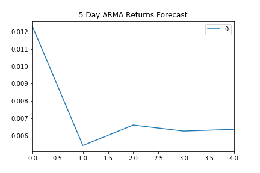
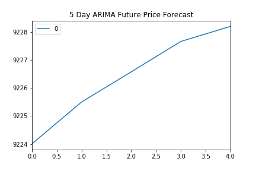
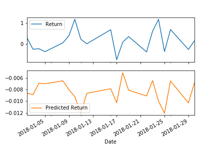

# TimeSeriesHW-10
Columbia Fintech Bootcamp Time Series #10 May 2021

## Background
The goal of this homework is to use Regression and Time Series Analysis to predict JPY vs USD. Two methods are used:
 <ol>
  <h3>
    <li>
      <a href="#time-series">Time Series</a>
    </li>
      <li>
      <a href="#Regression">Regression</a>
    </li>
  </h3>
</ol> 
The questions, answers and links to the notebooks are below.

## Time Series
File is here
[Hassan Time Series Answer](ha_time_series.ipynb)
### 1. Decomposition using a Hodrick-Prescott Filter.

#### 2. Forecasting Returns using an ARMA Model.

#### 3.Forecasting the Settle Price using an ARIMA Model.

#### 4. Forecasting Volatility with GARCH.

### Questions based on Time Series:

 <ol>
  <h4>
  <li>Based on your time series analysis, would you buy the yen now? </li>
      
      The Hodrick filter seems to indcate an upward trend.
      The ARMA Model indicates the short term returns are good
      The ARIMA Model indicates the price will go up
      Based on this I would buy Yen now.
      
  </li>

  <li>Is the risk of the yen expected to increase or decrease?</li>
     
    Based on GARCH, the risk is expected to increase.
    
  <li>Based on the model evaluation, would you feel confident in using these models for trading?</li>
      
    Based on the P values, I would not use this model. The P values >> .05
  </h4>
</ol> 

## Regression
File is Here
[Hassan Regression Answer](ha_regression.ipynb)
### 1.Data Preparation.
### 2.Fitting a Linear Regression Model.
### 3.Making predictions using the testing data.

### 4.Out-of-sample performance.
### 5.In-sample performance.     

### Question based on Regression Analysis:
 <ul>
     <h4>
         <li>
Does this model perform better or worse on out-of-sample data compared to in-sample data?
         </li>  
     </h4>
 <ul>

In sample RMSE 0.5963660785073426 > out of sample 0.4154832784856737 model does better in out of sample data. 